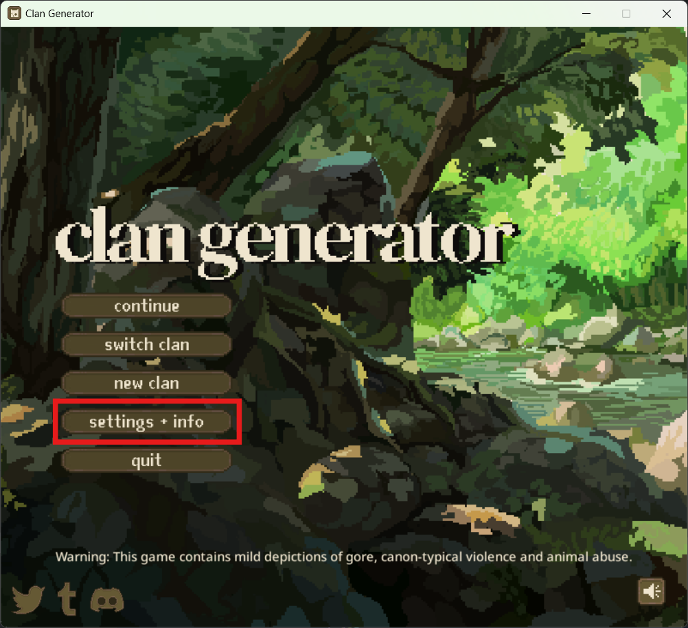
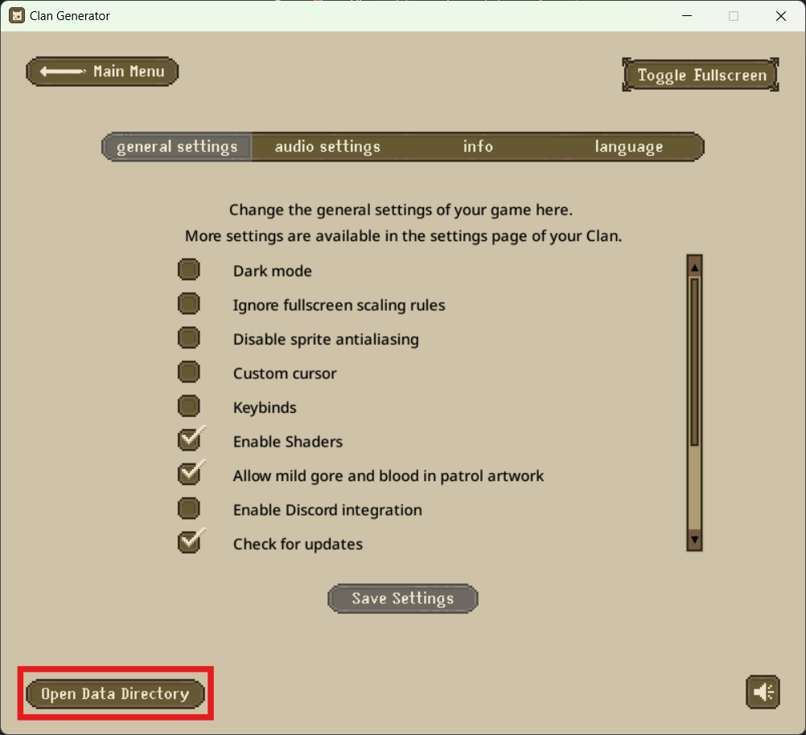
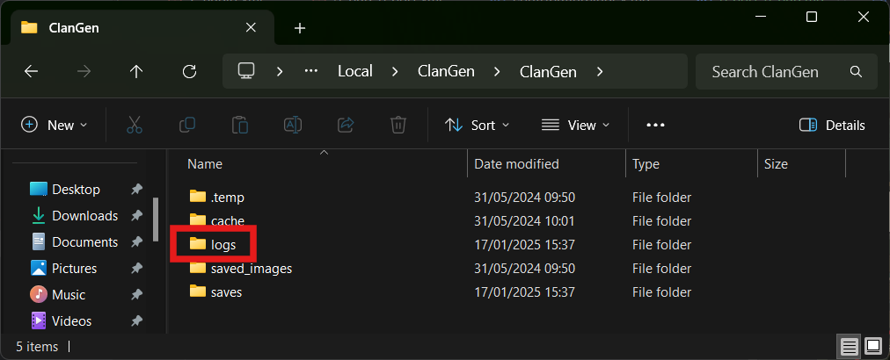
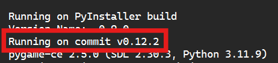
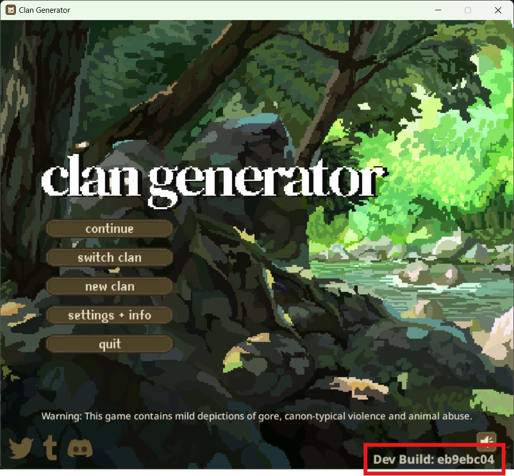

# Reporting a Bug

!!! important
    DO NOT report bugs found on a LifeGen save to ClanGen!!

Thank you for taking interest in reporting a bug to the LifeGen team! We're aware there's a lot of them -- we apologize for the inconvenience.

Unfortunately, for now, LifeGen only officially takes bug reports reported to the [LifeGen Server's](https://discord.gg/8zzYaTD6Q5) #bugs and #dialogue-bugs. GitHub issues has not yet been set-up.

## Bugs as a result of Save Editing and Mods

Save File Editing is a constant game-breaker for many, and we do not accept bugs that are DIRECTLY caused by save file editing. However, if the save has been edited but the bug is completely separate from it, LifeGen won't make it a big deal. We like squashing bugs!

Modded versions of LifeGen, however, are not allowed to be reported to us. Any bugs on a modded game are to be reported to the mod thread/creator.

## FAQs

- [How do I find my game version?](#how-do-i-find-my-game-version)
- [How do I find the error log?](#how-do-i-find-the-error-log)

### How do I find my game version?

#### Playing stable

If the version number isn't shown at the bottom right hand corner of the game's window, follow below:

1. If you can open the game, press the settings + info button
   

    !!! tip "Can't open the game?"
        Jump to [can't open the game](#cant-open-the-game).

2. Press "Open Data Directory". This will open a file explorer on your computer.
   
3. Open the "logs" folder.
   
4. Find the most recent stdout file and open it in Notepad or a similar text editing program.
5. Copy the version number from the third line, "Running on commit [...]"
   

    !!! tip
        If you don't see something that looks like this, ensure you selected std**OUT**, not std**ERR**.

#### Playing source

On development versions of ClanGen, the commit number is in the bottom-right of every screen.

#### Can't open the game?

If the game immediately crashes, you can get to the default log location manually.

=== "Source"
If you are running a source code version of LifeGen, the log files are stored in a folder called `logs` within the folder the source files are located in.

=== "Stable (standalone executable)"
| Operating System | Default Location |
|------------------|--------------------------------------------------------------|
| Windows | `C:\Users\[your user name]\AppData\Local\ClanGen\ClanGen/logs` |
| Mac | `/Users/[your user name]/Library/Application Support/ClanGen/logs` |
| Linux | `/home/[your user name]/.local/share/ClanGen/logs` |

=== "Development (standalone executable)"
| Operating System | Default Location |
|------------------|------------------------------------------------------------------|
| Windows | `C:\Users\[your user name]\AppData\Local\ClanGen\ClanGenBeta/logs` |
| Mac | `/Users/[your user name]/Library/Application Support/ClanGenBeta/logs` |
| Linux | `/home/[your user name]/.local/share/ClanGenBeta/logs` |

### What's a patrol ID? Do I need it?

The patrol ID is a string that the game and developers use to refer to the sequence of events in a patrol. It might look
like this: `gen_hunt_rabbit`.

If you encountered your issue on the Patrol screen at some point after selecting cats, we'll want the patrol ID to
investigate what happened.

### How do I find the patrol ID?

See the section on [finding your game version](#how-do-i-find-my-game-version) to find the stdout file. Scroll right to
the bottom of that file and find the affected patrol (it can be identified by which cats were on it if it's not the last
one).

### How do I find the error log?

See the section on [finding your game version](#how-do-i-find-my-game-version) to find the log directory. Instead of
selecting `stdout`, find and upload the most recent `stderr`. You can either upload the file or copy its contents, but
the entire file's contents are required.
